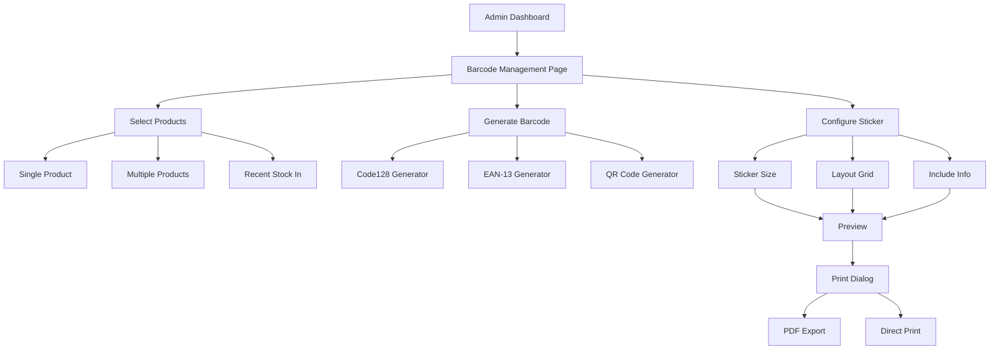

# 🏷️ Barcode Generator System - Implementation Plan

## 📋 Overview

ระบบ **Barcode Generator** เป็นฟีเจอร์สุดท้ายที่จะทำให้ Smart Inventory System สมบูรณ์แบบ โดยจะช่วยให้ Admin สามารถพิมพ์สติกเกอร์บาร์โค้ดสำหรับแปะกล่องสินค้าได้ทันทีหลังจากรับของเข้า โดยไม่ต้องใช้โปรแกรมอื่น

---

## 🎯 Objectives

### หลัก (Core Features)

1. **Generate Barcode** - สร้างบาร์โค้ดจาก SKU หรือ Barcode Number ของสินค้า
2. **Print Sticker** - พิมพ์สติกเกอร์บาร์โค้ดในรูปแบบมาตรฐาน (Code128, EAN-13)
3. **Batch Printing** - พิมพ์บาร์โค้ดหลายชิ้นพร้อมกันได้
4. **Custom Template** - กำหนดขนาดและรูปแบบสติกเกอร์ได้

### เสริม (Additional Features)

5. **Preview Before Print** - ดูตัวอย่างก่อนพิมพ์
6. **QR Code Support** - รองรับ QR Code สำหรับข้อมูลเพิ่มเติม
7. **Auto-Generate on Stock In** - ตัวเลือกพิมพ์อัตโนมัติเมื่อรับของเข้า
8. **Save Templates** - บันทึกเทมเพลตที่ใช้บ่อย

---

## 🏗️ System Architecture



---

## 📦 Database Schema

### ตาราง: `barcode_templates`

จัดเก็บเทมเพลตสติกเกอร์ที่ผู้ใช้สร้างและบันทึกไว้

```sql
CREATE TABLE `barcode_templates` (
    `id` INT AUTO_INCREMENT PRIMARY KEY,
    `user_id` INT NOT NULL,
    `name` VARCHAR(100) NOT NULL COMMENT 'ชื่อเทมเพลต',
    `width` DECIMAL(5,2) NOT NULL DEFAULT 50.00 COMMENT 'ความกว้าง (mm)',
    `height` DECIMAL(5,2) NOT NULL DEFAULT 25.00 COMMENT 'ความสูง (mm)',
    `barcode_type` ENUM('code128', 'ean13', 'qrcode') DEFAULT 'code128',
    `include_name` BOOLEAN DEFAULT TRUE COMMENT 'แสดงชื่อสินค้า',
    `include_price` BOOLEAN DEFAULT FALSE COMMENT 'แสดงราคา',
    `include_sku` BOOLEAN DEFAULT TRUE COMMENT 'แสดง SKU',
    `font_size` INT DEFAULT 10 COMMENT 'ขนาดตัวอักษร (pt)',
    `created_at` TIMESTAMP DEFAULT CURRENT_TIMESTAMP,
    FOREIGN KEY (`user_id`) REFERENCES `users`(`id`) ON DELETE CASCADE
) ENGINE=InnoDB DEFAULT CHARSET=utf8mb4;
```

### ตาราง: `print_history`

บันทึกประวัติการพิมพ์บาร์โค้ด (Optional - สำหรับ tracking)

```sql
CREATE TABLE `print_history` (
    `id` INT AUTO_INCREMENT PRIMARY KEY,
    `user_id` INT NOT NULL,
    `product_id` INT NOT NULL,
    `quantity` INT NOT NULL DEFAULT 1 COMMENT 'จำนวนที่พิมพ์',
    `template_id` INT NULL COMMENT 'เทมเพลตที่ใช้',
    `printed_at` TIMESTAMP DEFAULT CURRENT_TIMESTAMP,
    FOREIGN KEY (`user_id`) REFERENCES `users`(`id`),
    FOREIGN KEY (`product_id`) REFERENCES `products`(`id`),
    FOREIGN KEY (`template_id`) REFERENCES `barcode_templates`(`id`) ON DELETE SET NULL
) ENGINE=InnoDB DEFAULT CHARSET=utf8mb4;
```

---

## 📁 File Structure

```
InventoryManagement/
├── public/
│   ├── barcode.php                    # หน้าจัดการบาร์โค้ดหลัก
│   ├── barcode_print.php              # หน้าพิมพ์บาร์โค้ด (Print-optimized)
│   └── api/
│       └── barcode.php                # API สำหรับ generate barcode
│
├── src/
│   ├── Models/
│   │   ├── BarcodeTemplate.php       # Model สำหรับเทมเพลต
│   │   └── PrintHistory.php          # Model สำหรับบันทึกประวัติ
│   │
│   └── Helpers/
│       └── BarcodeGenerator.php      # Helper สำหรับ generate barcode
│
├── templates/
│   └── barcode/
│       ├── generator.php              # UI สำหรับเลือกสินค้า
│       ├── preview.php                # Preview สติกเกอร์
│       └── sticker_templates/
│           ├── standard.php           # เทมเพลตมาตรฐาน 50x25mm
│           ├── large.php              # เทมเพลตใหญ่ 70x40mm
│           └── compact.php            # เทมเพลตเล็ก 40x20mm
│
├── assets/
│   ├── css/
│   │   └── barcode-print.css          # CSS สำหรับพิมพ์
│   └── js/
│       └── barcode.js                 # JavaScript สำหรับ barcode
│
└── vendor/                            # External Libraries
    └── barcode/
        └── barcode.min.js             # JsBarcode Library
```

---

## 🔧 Technical Stack

### 1. **Barcode Generation Library**

#### Option A: **JsBarcode** (JavaScript - แนะนำ)

- **ข้อดี**:
  - Generate แบบ client-side ไม่ใช้ server resources
  - รองรับหลายรูปแบบ (CODE128, EAN, UPC, ITF, MSI, Pharmacode)
  - Responsive และ Customizable
  - ไม่ต้องติดตั้งอะไรเพิ่ม
- **ข้อเสีย**: ต้องมี JavaScript enabled

```html
<script src="https://cdn.jsdelivr.net/npm/jsbarcode@3.11.5/dist/JsBarcode.all.min.js"></script>
```

#### Option B: **PHP Barcode Generator** (Server-side)

- **ข้อดี**:
  - ทำงานโดยไม่ต้องพึ่ง JavaScript
  - Generate เป็นรูปภาพ PNG/SVG
- **ข้อเสีย**: ใช้ server resources

```bash
composer require picqer/php-barcode-generator
```

**คำแนะนำ:** ใช้ **JsBarcode** เป็นหลัก เพราะเร็วและไม่ต้องติดตั้งอะไร

---

### 2. **QR Code Generation**

#### **QRCode.js** (JavaScript)

```html
<script src="https://cdn.jsdelivr.net/npm/qrcodejs@1.0.0/qrcode.min.js"></script>
```

---

### 3. **Print Optimization**

#### CSS สำหรับพิมพ์

```css
@media print {
  @page {
    size: A4;
    margin: 5mm;
  }

  body {
    margin: 0;
    padding: 0;
  }

  .no-print {
    display: none !important;
  }

  .sticker {
    page-break-inside: avoid;
    page-break-after: auto;
  }
}
```

---

## 🎨 UI/UX Design

### 1. **Barcode Management Page** (`barcode.php`)

#### Layout หลัก

```
┌─────────────────────────────────────────────────────────┐
│  🏷️ Barcode Generator                         [🔍 Search]│
├─────────────────────────────────────────────────────────┤
│                                                           │
│  📦 Select Products                                       │
│  ┌───────────────────────────────────────────────────┐  │
│  │ ☑ SKU-001 - iPhone 15 Pro Max (Stock: 50)        │  │
│  │ ☑ SKU-002 - Samsung Galaxy S24 (Stock: 30)       │  │
│  │ ☐ SKU-003 - MacBook Pro M3 (Stock: 15)           │  │
│  └───────────────────────────────────────────────────┘  │
│                                                           │
│  ⚙️ Sticker Settings                                      │
│  ┌───────────────────────────────────────────────────┐  │
│  │ Template: [Standard 50x25mm ▼]                    │  │
│  │ Barcode Type: [CODE128 ▼]                         │  │
│  │ Quantity per Product: [2]                         │  │
│  │                                                     │  │
│  │ ☑ Show Product Name                               │  │
│  │ ☑ Show SKU                                        │  │
│  │ ☐ Show Price                                      │  │
│  └───────────────────────────────────────────────────┘  │
│                                                           │
│  [👁️ Preview] [🖨️ Print Stickers]                        │
└─────────────────────────────────────────────────────────┘
```

---

### 2. **Sticker Template Example**

#### Standard Template (50mm x 25mm)

```
┌──────────────────────────────────┐
│ iPhone 15 Pro Max                │
│ ▮ ▮ ▮▮  ▮  ▮▮▮ ▮▮   ▮▮  ▮ ▮ ▮  │ ← Barcode
│ SKU-001                          │
│ ฿ 45,900                         │
└──────────────────────────────────┘
```

#### Large Template (70mm x 40mm)

```
┌────────────────────────────────────────┐
│                                        │
│  iPhone 15 Pro Max 256GB               │
│                                        │
│  ▮ ▮ ▮▮  ▮  ▮▮▮ ▮▮   ▮▮  ▮ ▮ ▮       │
│                                        │
│  SKU: SKU-001                          │
│  Price: ฿ 45,900                       │
│  Stock: 50 units                       │
└────────────────────────────────────────┘
```

#### Compact Template (40mm x 20mm)

```
┌──────────────────────────┐
│ ▮ ▮ ▮▮  ▮  ▮▮▮ ▮▮   ▮  │
│ SKU-001                  │
└──────────────────────────┘
```

---

### 3. **Preview Modal**

```
┌─────────────────────────────────────────────────────────┐
│  Preview                                        [✕ Close]│
├─────────────────────────────────────────────────────────┤
│                                                           │
│  Page 1 of 2                              [◀ Prev | Next ▶]│
│                                                           │
│  ┌──────────┬──────────┬──────────┬──────────┐          │
│  │ Sticker1 │ Sticker2 │ Sticker3 │ Sticker4 │          │
│  │   📦     │   📦     │   📦     │   📦     │          │
│  ├──────────┼──────────┼──────────┼──────────┤          │
│  │ Sticker5 │ Sticker6 │ Sticker7 │ Sticker8 │          │
│  │   📦     │   📦     │   📦     │   📦     │          │
│  ├──────────┼──────────┼──────────┼──────────┤          │
│  │ Sticker9 │ Sticker10│ Sticker11│ Sticker12│          │
│  │   📦     │   📦     │   📦     │   📦     │          │
│  └──────────┴──────────┴──────────┴──────────┘          │
│                                                           │
│             [🖨️ Print All] [⬇️ Export PDF]                │
└─────────────────────────────────────────────────────────┘
```

---

## 🔄 Implementation Workflow

### Phase 1: Database & Models (30 นาที)

1. ✅ สร้าง SQL schema สำหรับ `barcode_templates` และ `print_history`
2. ✅ สร้าง Model `BarcodeTemplate.php`
3. ✅ สร้าง Model `PrintHistory.php`
4. ✅ สร้าง Helper `BarcodeGenerator.php`

### Phase 2: Backend API (45 นาที)

5. ✅ สร้าง API endpoint `/api/barcode.php` สำหรับ:
   - `GET /api/barcode.php?action=get_products` - ดึงรายการสินค้า
   - `GET /api/barcode.php?action=get_templates` - ดึงเทมเพลต
   - `POST /api/barcode.php?action=save_template` - บันทึกเทมเพลต
   - `POST /api/barcode.php?action=save_history` - บันทึกประวัติการพิมพ์

### Phase 3: Frontend UI (1 ชม.)

6. ✅ สร้างหน้า `barcode.php` - หน้าหลักจัดการบาร์โค้ด
7. ✅ สร้าง `templates/barcode/generator.php` - UI เลือกสินค้า
8. ✅ สร้าง `templates/barcode/preview.php` - Preview stickers
9. ✅ เพิ่ม JavaScript สำหรับ:
   - เลือกสินค้าแบบ checkbox
   - Generate barcode ด้วย JsBarcode
   - Preview real-time

### Phase 4: Print Templates (45 นาที)

10. ✅ สร้าง `barcode_print.php` - หน้าพิมพ์เฉพาะ
11. ✅ สร้างเทมเพลต 3 แบบ:
    - `standard.php` (50x25mm)
    - `large.php` (70x40mm)
    - `compact.php` (40x20mm)
12. ✅ เพิ่ม CSS สำหรับพิมพ์ (`barcode-print.css`)

### Phase 5: Testing & Integration (30 นาที)

13. ✅ ทดสอบ generate barcode ทุกประเภท
14. ✅ ทดสอบพิมพ์สติกเกอร์
15. ✅ ทดสอบ responsive บนหน้าจอต่างๆ
16. ✅ เพิ่มลิงก์ไปหน้า Barcode ใน sidebar

---

## 💡 Features Detail

### 1. **Barcode Types Support**

#### CODE128

- รองรับตัวอักษร ASCII ทั้งหมด
- เหมาะสำหรับ SKU ที่มีตัวอักษรและตัวเลขผสม
- ตัวอย่าง: `SKU-001`, `PROD-2024-001`

#### EAN-13

- รหัสมาตรฐานสากล 13 หลัก
- เหมาะสำหรับสินค้าที่จำหน่ายทั่วไป
- ตัวอย่าง: `8850123456789`

#### QR Code

- เก็บข้อมูลได้มาก (URL, JSON, Text)
- สแกนง่าย ไม่ต้องใช้เครื่องสแกนบาร์โค้ด
- ตัวอย่างข้อมูล:

```json
{
  "sku": "SKU-001",
  "name": "iPhone 15 Pro Max",
  "price": 45900,
  "url": "https://inventory.com/product/SKU-001"
}
```

---

### 2. **Batch Printing**

#### Grid Layout

- **4 columns x 3 rows** = 12 stickers per A4 page (สำหรับ 50x25mm)
- **3 columns x 2 rows** = 6 stickers per A4 page (สำหรับ 70x40mm)
- **5 columns x 4 rows** = 20 stickers per A4 page (สำหรับ 40x20mm)

#### Quantity Control

- ระบุจำนวนที่ต้องการพิมพ์ต่อสินค้า
- ระบบคำนวณจำนวนหน้าอัตโนมัติ
- แสดง pagination ใน preview

---

### 3. **Auto-Generate on Stock In** (Optional)

เมื่อรับสินค้าเข้าใน `stock_in.php`:

```php
// After successful stock in
if (isset($_POST['auto_print_barcode']) && $_POST['auto_print_barcode'] == '1') {
    $product_id = $_POST['product_id'];
    $quantity = $_POST['quantity'];

    // Redirect to print page
    header("Location: barcode_print.php?product_id=$product_id&qty=$quantity");
    exit;
}
```

---

## 🖨️ Print Specifications

### Paper Size

- **A4 (210mm x 297mm)** - มาตรฐาน
- รองรับ **กระดาษสติกเกอร์** ทุกยี่ห้อ

### Sticker Sizes (Common Standards)

- **50mm x 25mm** - ขนาดมาตรฐาน (เหมาะกับกล่องขนาดกลาง)
- **70mm x 40mm** - ขนาดใหญ่ (เหมาะกับกล่องใหญ่)
- **40mm x 20mm** - ขนาดเล็ก (เหมาะกับกล่องเล็ก/ห่อ)

### Margins

- **Top/Bottom:** 5mm
- **Left/Right:** 5mm
- **Gap between stickers:** 2mm

### Font

- **Product Name:** Sarabun Bold, 10-12pt
- **SKU:** Sarabun Regular, 8pt
- **Price:** Sarabun Medium, 9pt

---

## 🔒 Security & Permissions

### Role-based Access

- **Admin**: ทุกอย่าง (Generate, Print, Save Templates, View History)
- **Staff**: Generate และ Print เท่านั้น (ไม่สามารถลบ Template)

### Input Validation

```php
// Validate quantity
if (!is_numeric($quantity) || $quantity <= 0 || $quantity > 1000) {
    throw new Exception("Quantity must be between 1-1000");
}

// Validate barcode type
$allowed_types = ['code128', 'ean13', 'qrcode'];
if (!in_array($barcode_type, $allowed_types)) {
    throw new Exception("Invalid barcode type");
}
```

---

## 📊 Example Code Snippets

### 1. **Generate Barcode with JsBarcode**

```javascript
// Generate barcode for SKU
function generateBarcode(sku, elementId) {
  JsBarcode(`#${elementId}`, sku, {
    format: "CODE128",
    width: 2,
    height: 50,
    displayValue: true,
    fontSize: 12,
    margin: 5,
  });
}

// Usage
generateBarcode("SKU-001", "barcode-sku-001");
```

---

### 2. **Print Stickers Layout (HTML)**

```html
<div class="print-page">
  <div class="sticker-grid">
    <!-- Row 1 -->
    <div class="sticker">
      <h6>iPhone 15 Pro Max</h6>
      <svg id="barcode-1"></svg>
      <p class="sku">SKU-001</p>
      <p class="price">฿ 45,900</p>
    </div>
    <div class="sticker">
      <!-- Sticker 2 -->
    </div>
    <!-- ... 10 more stickers ... -->
  </div>
</div>
```

---

### 3. **CSS for Print**

```css
@media print {
  .sticker {
    width: 50mm;
    height: 25mm;
    border: 1px dashed #ccc;
    padding: 2mm;
    box-sizing: border-box;
    text-align: center;
    page-break-inside: avoid;
  }

  .sticker h6 {
    font-size: 10pt;
    margin: 0 0 1mm 0;
    text-overflow: ellipsis;
    overflow: hidden;
    white-space: nowrap;
  }

  .sticker svg {
    width: 100%;
    height: 12mm;
  }

  .sticker .sku {
    font-size: 8pt;
    margin: 1mm 0;
  }

  .sticker .price {
    font-size: 9pt;
    font-weight: bold;
    margin: 0;
  }
}
```

---

## 🎯 User Stories

### User Story 1: พิมพ์สติกเกอร์สินค้าใหม่

```
As an Admin
I want to print barcode stickers for new products
So that I can label the boxes immediately after stock in

Given: ผมรับสินค้าใหม่เข้า 50 ชิ้น
When: ผมไปที่หน้า Barcode Generator
And: เลือกสินค้าที่ต้องการ
And: ตั้งค่าให้พิมพ์ 2 สติกเกอร์ต่อกล่อง
Then: ระบบแสดง preview สติกเกอร์ทั้งหมด 100 ชุด
And: ผมสามารถกดพิมพ์ได้ทันที
```

### User Story 2: ใช้เทมเพลตที่บันทึกไว้

```
As a Staff
I want to use saved templates
So that I don't have to configure settings every time

Given: มีเทมเพลต "Standa rd Product Label" ที่บันทึกไว้
When: ผมไปที่หน้า Barcode Generator
And: เลือกเทมเพลต "Standard Product Label"
Then: ระบบโหลดการตั้งค่าทั้งหมดจากเทมเพลต
And: ผมแค่เลือกสินค้าและกดพิมพ์
```

---

## 📈 Future Enhancements (v2.0)

1. **Barcode Scanner Integration** - สแกนบาร์โค้ดเพื่อค้นหาสินค้า
2. **Mobile App Support** - พิมพ์ผ่านมือถือด้วย Bluetooth printer
3. **Batch Import** - อัปโหลด CSV เพื่อพิมพ์จำนวนมาก
4. **Multi-language QR** - QR Code ที่มีข้อมูลหลายภาษา
5. **Custom Design Editor** - ออกแบบสติกเกอร์เองแบบ Drag & Drop

---

## 🧪 Testing Checklist

### Functional Testing

- [ ] สร้างบาร์โค้ด CODE128 ได้ถูกต้อง
- [ ] สร้างบาร์โค้ด EAN-13 ได้ถูกต้อง
- [ ] สร้าง QR Code ได้ถูกต้อง
- [ ] พิมพ์สติกเกอร์ทีละรายการ
- [ ] พิมพ์สติกเกอร์หลายรายการพร้อมกัน
- [ ] Preview แสดงผลถูกต้อง
- [ ] บันทึกเทมเพลตได้
- [ ] โหลดเทมเพลตที่บันทึกไว้ได้
- [ ] บันทึกประวัติการพิมพ์

### UI/UX Testing

- [ ] หน้าจอ responsive บนมือถือ/แท็บเล็ต
- [ ] สติกเกอร์พิมพ์ออกมาสวยงาม ชัดเจน
- [ ] ตัวอักษรอ่านง่าย ไม่เบลอ
- [ ] บาร์โค้ดสแกนได้ด้วยเครื่องอ่าน
- [ ] QR Code สแกนได้ด้วยมือถือ

### Performance Testing

- [ ] Generate บาร์โค้ด 100 รายการใน < 2 วินาที
- [ ] Preview โหลดไวภายใน 1 วินาที
- [ ] พิมพ์ไม่มีปัญหา lag

---

## 📝 Documentation

### API Documentation

#### Endpoint: `/api/barcode.php`

**1. Get Products for Barcode**

```http
GET /api/barcode.php?action=get_products&search=iphone
```

Response:

```json
{
  "success": true,
  "data": [
    {
      "id": 1,
      "sku": "SKU-001",
      "barcode": "8850123456789",
      "name": "iPhone 15 Pro Max",
      "price": 45900,
      "stock_quantity": 50
    }
  ]
}
```

**2. Save Print History**

```http
POST /api/barcode.php?action=save_history
Content-Type: application/json

{
  "product_id": 1,
  "quantity": 10,
  "template_id": 2
}
```

---

## 🎨 Screenshots & Mockups

_Note: จะมีการสร้าง mockup ด้วย generate_image เพื่อแสดงตัวอย่าง UI_

### 1. Barcode Management Page


### 2. Print Preview


### 3. Printed Sticker Example


---

## ⚙️ Configuration

### Default Settings

```php
// config/barcode.php
return [
    'default_template' => 'standard',
    'default_barcode_type' => 'code128',
    'default_quantity' => 1,
    'max_print_quantity' => 1000,
    'sticker_sizes' => [
        'standard' => ['width' => 50, 'height' => 25],
        'large' => ['width' => 70, 'height' => 40],
        'compact' => ['width' => 40, 'height' => 20]
    ],
    'fonts' => [
        'product_name' => ['family' => 'Sarabun', 'weight' => 'Bold', 'size' => 10],
        'sku' => ['family' => 'Sarabun', 'weight' => 'Regular', 'size' => 8],
        'price' => ['family' => 'Sarabun', 'weight' => 'Medium', 'size' => 9]
    ]
];
```

---

## 🚀 Deployment Checklist

- [ ] รัน SQL migrations สำหรับตาราง `barcode_templates` และ `print_history`
- [ ] ตรวจสอบว่า JsBarcode CDN โหลดได้
- [ ] ทดสอบพิมพ์บนเครื่องพิมพ์จริง
- [ ] ทดสอบสแกนบาร์โค้ดด้วยเครื่องอ่านจริง
- [ ] เพิ่มลิงก์ใน sidebar menu
- [ ] Update README.md หลัก
- [ ] สร้าง User Guide วิธีใช้งาน
- [ ] Commit และ Push ขึ้น GitHub

---

## 💰 Estimated Time

| Phase     | Task                  | Time           |
| --------- | --------------------- | -------------- |
| 1         | Database & Models     | 30 min         |
| 2         | Backend API           | 45 min         |
| 3         | Frontend UI           | 60 min         |
| 4         | Print Templates       | 45 min         |
| 5         | Testing & Integration | 30 min         |
| **Total** |                       | **~3.5 hours** |

---

## 🎓 Learning Resources

### Libraries Documentation

- [JsBarcode Documentation](https://github.com/lindell/JsBarcode)
- [QRCode.js Documentation](https://davidshimjs.github.io/qrcodejs/)
- [CSS Print Styles](https://www.smashingmagazine.com/2018/05/print-stylesheets-in-2018/)

### Barcode Standards

- [CODE128 Specification](https://en.wikipedia.org/wiki/Code_128)
- [EAN-13 Specification](https://en.wikipedia.org/wiki/International_Article_Number)

---

## ✅ Success Criteria

ระบบ Barcode Generator จะถือว่าสำเร็จเมื่อ:

1. ✅ **Functional**: Admin สามารถพิมพ์สติกเกอร์บาร์โค้ดได้ทันทีหลังรับของเข้า
2. ✅ **Quality**: บาร์โค้ดสแกนได้ 100% ด้วยเครื่องอ่านทั่วไป
3. ✅ **User-friendly**: ใช้งานง่าย ไม่ซับซ้อน คลิกไม่เกิน 3 ครั้งก็พิมพ์ได้
4. ✅ **Efficient**: พิมพ์ได้เร็ว ไม่ต้องรอนาน
5. ✅ **Professional**: สติกเกอร์ออกมาสวย อ่านง่าย ดูมืออาชีพ

---

## 🎉 Conclusion

ระบบ **Barcode Generator** จะทำให้ Smart Inventory System **สมบูรณ์แบบ** โดยไม่ต้องพึ่งโปรแกรมภายนอก Admin สามารถทำงานได้อย่างต่อเนื่องตั้งแต่:

1. รับสินค้าเข้า (`stock_in.php`)
2. พิมพ์บาร์โค้ดแปะกล่อง (`barcode.php`) ← **NEW!**
3. เบิกของออก (`stock_out.php`)
4. ดูรายงาน (`reports.php`)
5. ได้รับการแจ้งเตือน (`notifications`)

**Ready to implement! 🚀**
